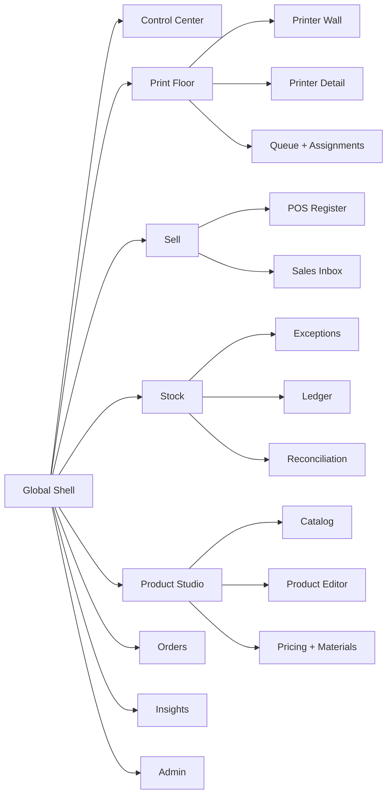

# Frontend Redesign User Story: Role-Based 3D Print Operations Console

## Proposed Issue Title

`Epic: redesign the frontend into role-based workspaces for print operations, POS, inventory, product studio, and business oversight`

## User Story

As a 3D print business team member working in one or more roles such as print operator, floor lead, cashier, inventory manager, product manager, or owner, I need the application to present the right tools, signals, and actions for my current job so I can run the business from one interface without hunting across disconnected CRUD pages.

## Why This Work Exists

The current frontend is competent but mostly route-first and page-first:

- Navigation is flat in [frontend/src/components/layout/appNav.ts](/Users/brentbengtson/github-files/3d-print-sales/frontend/src/components/layout/appNav.ts).
- The shell in [frontend/src/components/layout/Layout.tsx](/Users/brentbengtson/github-files/3d-print-sales/frontend/src/components/layout/Layout.tsx) treats every domain as an equal destination instead of a role-oriented workspace.
- Operationally important areas already exist, but they are fragmented:
  - Printer monitoring and live thumbnails in [frontend/src/pages/PrintersPage.tsx](/Users/brentbengtson/github-files/3d-print-sales/frontend/src/pages/PrintersPage.tsx) and [frontend/src/pages/PrinterDetailPage.tsx](/Users/brentbengtson/github-files/3d-print-sales/frontend/src/pages/PrinterDetailPage.tsx)
  - POS in [frontend/src/pages/POSPage.tsx](/Users/brentbengtson/github-files/3d-print-sales/frontend/src/pages/POSPage.tsx)
  - Inventory reconciliation and stock adjustments in [frontend/src/pages/InventoryPage.tsx](/Users/brentbengtson/github-files/3d-print-sales/frontend/src/pages/InventoryPage.tsx)
  - Product management in [frontend/src/pages/ProductsPage.tsx](/Users/brentbengtson/github-files/3d-print-sales/frontend/src/pages/ProductDetailPage.tsx)
  - Jobs and quoting logic in [frontend/src/pages/JobsPage.tsx](/Users/brentbengtson/github-files/3d-print-sales/frontend/src/pages/JobsPage.tsx), [frontend/src/pages/JobDetailPage.tsx](/Users/brentbengtson/github-files/3d-print-sales/frontend/src/pages/JobDetailPage.tsx), and [frontend/src/pages/CalculatorPage.tsx](/Users/brentbengtson/github-files/3d-print-sales/frontend/src/pages/CalculatorPage.tsx)
- The visual system in [frontend/src/index.css](/Users/brentbengtson/github-files/3d-print-sales/frontend/src/index.css) is serviceable but generic. It defaults to familiar dashboard styling instead of a deliberate operational identity.

This redesign should optimize for the most frequent workflows first, which follows the repo’s UX guidance around Pareto Principle, Hick’s Law, Jakob’s Law, Fitts’s Law, and Doherty Threshold.

## Current-State Findings

### What already works

- Protected app shell, persisted auth, and basic responsive behavior are already in place.
- The printer domain is stronger than the rest of the UI suggests:
  - normalized live status
  - WebSocket freshness for Moonraker
  - print progress, temperatures, ETA, layers
  - backend-served print thumbnails through `/api/v1/printers/{id}/thumbnail`
- POS already supports:
  - product-first checkout
  - barcode scan resolution
  - touch-friendly cart controls
  - guest or attached customer checkout
- Inventory already supports:
  - low-stock alerts
  - reconciliation
  - manual adjustments
  - transaction ledger

### Main UX problems

- The app is organized around tables and forms instead of operator intent.
- Print monitoring is available, but there is no “war room” or “printer wall” mode for floor use.
- Live camera views are not modeled in the backend or frontend today. The redesign should introduce a camera capability intentionally rather than pretending thumbnails are cameras.
- Product creation is still a modal CRUD flow, even though products sit at the intersection of pricing, material, stock, POS, and sales.
- Inventory actions are mixed into a ledger page instead of a task-driven control surface.
- Dashboard cards expose many metrics, but the page is not opinionated about what each role needs next.

## Roles To Support

### Print Operator

Primary goals:

- know which printers are healthy
- see what is printing now
- spot errors, pauses, stale sockets, and ETAs immediately
- jump from printer to assigned job without context switching

### Floor Lead

Primary goals:

- manage fleet utilization
- rebalance jobs across printers
- see blocked printers and work queues
- coordinate labor, rush jobs, and attention events

### Cashier / Retail Staff

Primary goals:

- complete walk-up sales fast
- scan products reliably
- avoid mis-taps on touch screens
- handle guest checkout and common payment methods with low friction

### Inventory Manager

Primary goals:

- see low stock by severity
- reconcile counts quickly
- understand stock movement by reason
- act on exceptions without reading a full ledger first

### Product Manager / Maker

Primary goals:

- create or refine a sellable product
- connect pricing, cost model, UPC, stock policy, imagery, and channel readiness
- validate margin before publishing to POS and catalog

### Owner / Admin

Primary goals:

- monitor revenue, print utilization, margin, inventory risk, and open exceptions
- move between operations and business views without losing context

## Scope

### In scope

- new information architecture
- role-based navigation and home experiences
- printer wall and printer detail redesign
- live camera view concept and required model additions
- POS redesign
- inventory control redesign
- product creation redesign
- dashboard and global shell redesign
- implementation scaffolding and route/component guidance

### Out of scope for the first slice

- replacing backend business rules
- changing accounting logic
- redesigning every admin screen
- inventing a video streaming backend without a camera configuration model

## Proposed Information Architecture

Replace the flat navigation with workspaces:

- `Control Center`
- `Print Floor`
- `Sell`
- `Stock`
- `Product Studio`
- `Orders`
- `Insights`
- `Admin`

Each workspace gets its own local navigation and default view. Users still have deep links, but the primary mental model becomes “where am I working right now?” instead of “which table page am I on?”



## Experience Direction

Use an operations-first visual system:

- dark-biased control-room shell for printer and POS workspaces
- lighter analytical surfaces for stock, product, and reporting screens
- typography:
  - heading: `Rubik`
  - body: `Nunito Sans`
- palette:
  - shell background: deep slate or near-black
  - primary action: saturated green for “go / complete / ready”
  - warning: amber
  - fault: red
  - informational highlights: cyan or blue

This direction is consistent with the UI skill guidance returned for a real-time monitoring product and is a better fit than the current default indigo-on-white token set.

## Workspace Concepts

### 1. Control Center

Purpose:

- landing space after login
- tailored summary by user role
- immediate queue of urgent work

Layout:

- top row: active shift, urgent exceptions, cash drawer state, floor utilization
- center: role-specific cards
- right rail: “needs attention now”

Example modules:

- `Printers needing attention`
- `Low stock that blocks production`
- `Open POS session`
- `Today’s sales and margin`
- `Products below reorder point`
- `Draft jobs missing printer assignment`

### 2. Print Floor

Purpose:

- primary operational workspace for printers and jobs

Key views:

- `Printer Wall`
- `Printer Detail`
- `Queue & Assignments`

#### Printer Wall

This becomes the high-frequency page for operators and floor leads.

Core behavior:

- large cards sized for glanceability from a distance
- status grouping: printing, ready, attention, offline
- auto-refresh cadence based on provider freshness
- wall mode with reduced chrome
- optional camera quadrant when cameras are configured

Card contents:

- printer name and location
- current job and product
- progress ring
- layer and ETA
- tool and bed temperatures
- socket freshness
- latest message
- camera or thumbnail tile
- actions: `Open`, `Reassign`, `Pause note`, `Refresh`

#### Camera support

The repo currently exposes print thumbnails, not live video streams. A real camera experience needs new fields, likely on `Printer`:

- `camera_enabled`
- `camera_provider`
- `camera_stream_url`
- `camera_snapshot_url`
- `camera_label`

The UI should support:

- grid of live camera tiles
- snapshot fallback when stream is unavailable
- privacy-safe opt-in configuration
- full-screen focus mode for one machine

### 3. Sell

Purpose:

- cashier-first and counter-first selling

Views:

- `POS Register`
- `Sales Inbox`
- `Receipt / Sale Detail`

#### POS Register

The current POS page is already the closest thing to a role-specific workspace. The redesign should deepen it.

Improvements:

- scanner lane always visible
- larger touch targets
- fewer competing inputs on initial view
- sticky totals and payment actions
- quick product category filters
- optional image tiles for high-frequency products
- explicit “guest / existing customer / create customer” switch
- checkout success state with next-action shortcuts

### 4. Stock

Purpose:

- exception-first inventory management

Views:

- `Exceptions`
- `Reconciliation`
- `Ledger`
- `Materials`

The default screen should not be the ledger. It should be an action queue:

- stockouts affecting POS
- stockouts affecting active jobs
- products near reorder point
- suspicious adjustments and waste spikes

### 5. Product Studio

Purpose:

- replace modal CRUD with a product workflow

Views:

- `Catalog`
- `Product Editor`
- `Pricing & Margin`
- `Readiness`

The editor should feel like a studio:

- left: identity, naming, SKU, UPC
- middle: pricing, material, cost, reorder point
- right: margin preview, stock readiness, POS visibility, channel readiness

### 6. Orders

Purpose:

- unify jobs, quotes, and sales-adjacent production work

Views:

- `Production Jobs`
- `Quotes`
- `Open Sales Requiring Fulfillment`

This reduces the gap between the sales side and the print floor.

## UX Laws Applied

- `Hick’s Law`: the flat nav becomes workspace nav plus local nav so users see fewer equal-weight choices at once.
- `Jakob’s Law`: each workspace still uses familiar patterns such as split panes, tabs, command bars, and detail drawers.
- `Fitts’s Law`: POS actions and printer-card actions get larger targets and spacing suitable for touch and shop-floor use.
- `Doherty Threshold`: all polling, refresh, and checkout actions should show feedback within roughly 400ms.
- `Law of Common Region` and `Proximity`: printer status, job, and telemetry belong in a single card region instead of scattered text rows.
- `Pareto Principle`: the redesign favors the high-frequency workflows already visible in the repo: print monitoring, POS, stock response, and product setup.

## Acceptance Criteria

### Global shell

- Users can enter the app into a workspace-oriented shell instead of the current flat nav.
- Navigation can be filtered by role without breaking deep links.
- The shell supports a dense desktop mode and a touch-friendly mode.

### Print floor

- Operators can identify any paused, offline, error, or stale printer within 5 seconds on the wall screen.
- Each printer card shows live telemetry and current print context using existing printer monitoring fields.
- The system supports camera tiles when a camera source is configured and snapshot fallback when it is not.

### POS

- Cashiers can complete a common sale with fewer decisions visible at once than the current form.
- Barcode scanning remains first-class and works with keyboard-wedge devices.
- Checkout, success, and error states are obvious and touch-friendly.

### Stock

- Inventory managers land on exceptions first, not the historical ledger.
- Reconciliation and quick adjustment actions are reachable without scrolling through transaction history.
- Product-impacting stock problems are visually distinguished from material-only problems.

### Product Studio

- Product creation no longer relies on a modal as the primary authoring surface.
- Margin, stock policy, and POS readiness are visible during editing.
- The flow supports both a fast create path and a detailed setup path.

### Documentation and implementation

- The redesign brief lives in repo docs and can be used as the source document for an implementation epic.
- Code examples map to the existing React, Vite, TanStack Query, Zustand, and Tailwind stack.

## UX Examples

### Example A: Printer Wall

```text
+----------------------------------------------------------------------------------+
| Print Floor                                                     Shift: Day       |
| 18 printers | 11 printing | 3 ready | 2 attention | 2 offline                   |
+----------------------------------------------------------------------------------+
| ATTENTION                                                                       |
| [A1 MK4]  Error: filament runout     Job J-2418  ETA --    Open  Reassign       |
| [X1C-02]  Paused by operator         Job J-2420  ETA 0:38  Open  Resume note    |
+----------------------------------------------------------------------------------+
| PRINTING                                                                        |
| [P1S-01]  72%   Layer 181/244   ETA 1h12m   nozzle 218 / bed 60   socket live   |
| [MK4-03]  15%   Layer 24/210    ETA 4h40m   nozzle 215 / bed 60   poll fallback |
+----------------------------------------------------------------------------------+
| READY                                                                           |
| [Voron-01] Idle in Bay 2                         Assign next job                 |
+----------------------------------------------------------------------------------+
```

### Example B: POS Register

```text
+------------------------------------------+--------------------------------------+
| Scan / Search                            | Cart                                 |
| [ Scan barcode ]                         | 3 items                              |
| [ Search products ]                      | Widget A            2 x $12.00       |
|                                          | Spacer Clip         1 x $4.00        |
| Quick Picks                              |                                      |
| [Best Sellers] [PLA Kits] [Accessories]  | Customer: Guest                      |
|                                          | Tax: $2.31                           |
| Product Tiles                            | Total: $30.31                        |
| [Image][Image][Image][Image]             |                                      |
|                                          | [Cash] [Card] [Other]                |
|                                          | [Complete Sale]                      |
+------------------------------------------+--------------------------------------+
```

### Example C: Product Studio

```text
+----------------------------------------------------------------------------------+
| Product Studio > Hydroponic Tower Clip                            Draft          |
+----------------------------------------------------------------------------------+
| Identity                | Pricing & Cost           | Readiness                   |
| Name                    | Unit Price               | POS visible: Yes            |
| SKU                     | Unit Cost                | UPC ready: Missing          |
| UPC                     | Target margin            | Reorder point: 12           |
| Description             | Material                 | Low-stock risk: Medium      |
|                         | Calculator link          | Sales channels: Direct      |
+----------------------------------------------------------------------------------+
| Recent stock activity                                                         |
+----------------------------------------------------------------------------------+
```

## Implementation Sketch

### Routing model

```tsx
// frontend/src/app/routes.tsx
export const appRoutes = [
  {
    path: '/',
    element: <AppShell />,
    children: [
      { index: true, element: <Navigate to="/control-center" replace /> },
      { path: 'control-center', element: <ControlCenterPage /> },
      {
        path: 'print-floor',
        element: <PrintFloorLayout />,
        children: [
          { index: true, element: <PrinterWallPage /> },
          { path: 'printers/:id', element: <PrinterConsolePage /> },
          { path: 'queue', element: <PrintQueuePage /> },
        ],
      },
      {
        path: 'sell',
        element: <SellLayout />,
        children: [
          { index: true, element: <POSRegisterPage /> },
          { path: 'sales', element: <SalesInboxPage /> },
        ],
      },
      {
        path: 'stock',
        element: <StockLayout />,
        children: [
          { index: true, element: <StockExceptionsPage /> },
          { path: 'ledger', element: <InventoryLedgerPage /> },
          { path: 'reconcile', element: <StockReconciliationPage /> },
        ],
      },
      {
        path: 'product-studio',
        element: <ProductStudioLayout />,
        children: [
          { index: true, element: <ProductCatalogPage /> },
          { path: 'new', element: <ProductEditorPage mode="create" /> },
          { path: ':id', element: <ProductEditorPage mode="edit" /> },
        ],
      },
    ],
  },
];
```

### Role-aware navigation

```ts
// frontend/src/components/layout/workspaceNav.ts
type Role = 'admin' | 'floor' | 'cashier' | 'inventory' | 'catalog';

type WorkspaceLink = {
  to: string;
  label: string;
  roles: Role[];
};

export const workspaceLinks: WorkspaceLink[] = [
  { to: '/control-center', label: 'Control Center', roles: ['admin', 'floor', 'cashier', 'inventory', 'catalog'] },
  { to: '/print-floor', label: 'Print Floor', roles: ['admin', 'floor'] },
  { to: '/sell', label: 'Sell', roles: ['admin', 'cashier'] },
  { to: '/stock', label: 'Stock', roles: ['admin', 'inventory', 'floor'] },
  { to: '/product-studio', label: 'Product Studio', roles: ['admin', 'catalog'] },
  { to: '/orders', label: 'Orders', roles: ['admin', 'floor', 'catalog'] },
  { to: '/insights', label: 'Insights', roles: ['admin'] },
];
```

### Visual tokens

```css
/* frontend/src/index.css */
@import url('https://fonts.googleapis.com/css2?family=Nunito+Sans:wght@400;500;600;700&family=Rubik:wght@500;600;700&display=swap');

@theme {
  --font-sans: 'Nunito Sans', ui-sans-serif, system-ui, sans-serif;
  --font-display: 'Rubik', ui-sans-serif, system-ui, sans-serif;

  --color-shell: #08111f;
  --color-panel: #0f1728;
  --color-panel-2: #152133;
  --color-ink: #e8eef7;
  --color-muted-foreground: #8fa3bf;
  --color-primary: #22c55e;
  --color-primary-foreground: #04110a;
  --color-warning: #f59e0b;
  --color-danger: #ef4444;
  --color-info: #38bdf8;
  --color-border: #22324a;
}

body {
  background:
    radial-gradient(circle at top left, rgba(56, 189, 248, 0.08), transparent 24%),
    radial-gradient(circle at top right, rgba(34, 197, 94, 0.06), transparent 20%),
    var(--color-shell);
  color: var(--color-ink);
}
```

### Printer wall card

```tsx
type PrinterWallCardProps = {
  printer: Printer;
  urgent?: boolean;
};

export function PrinterWallCard({ printer, urgent = false }: PrinterWallCardProps) {
  const status = printer.monitor_status || printer.status;

  return (
    <article
      className={cn(
        'grid gap-4 rounded-3xl border p-4 transition-colors',
        urgent ? 'border-amber-400/50 bg-amber-500/10' : 'border-border bg-card/70'
      )}
    >
      <header className="flex items-start justify-between gap-3">
        <div>
          <h3 className="font-display text-lg font-semibold">{printer.name}</h3>
          <p className="text-sm text-muted-foreground">{printer.location || 'Unassigned bay'}</p>
        </div>
        <StatusPill status={status} />
      </header>

      <div className="grid grid-cols-[96px_minmax(0,1fr)] gap-4">
        <PrinterThumbnail
          src={printer.current_print_thumbnail_url}
          alt={printer.current_print_name || `${printer.name} live thumbnail`}
          className="h-24 w-24 rounded-2xl"
          imgClassName="object-cover"
          fallbackLabel="No view"
        />

        <div className="space-y-2">
          <p className="truncate text-sm font-medium">
            {printer.current_print_name || 'No active print'}
          </p>
          <dl className="grid grid-cols-2 gap-x-4 gap-y-2 text-sm">
            <div>
              <dt className="text-muted-foreground">Progress</dt>
              <dd>{printer.monitor_progress_percent?.toFixed(0) ?? '0'}%</dd>
            </div>
            <div>
              <dt className="text-muted-foreground">ETA</dt>
              <dd>{formatDuration(printer.monitor_remaining_seconds)}</dd>
            </div>
            <div>
              <dt className="text-muted-foreground">Layer</dt>
              <dd>{formatLayer(printer.monitor_current_layer, printer.monitor_total_layers)}</dd>
            </div>
            <div>
              <dt className="text-muted-foreground">Transport</dt>
              <dd>{printer.monitor_ws_connected ? 'Socket live' : 'Polling'}</dd>
            </div>
          </dl>
        </div>
      </div>

      <footer className="flex gap-2">
        <Link to={`/print-floor/printers/${printer.id}`} className="rounded-xl bg-primary px-3 py-2 text-sm font-semibold text-primary-foreground no-underline">
          Open
        </Link>
        <button className="rounded-xl border border-border px-3 py-2 text-sm">Reassign</button>
      </footer>
    </article>
  );
}
```

### POS split-pane frame

```tsx
export function POSRegisterPage() {
  return (
    <main className="grid min-h-[calc(100vh-5rem)] gap-4 xl:grid-cols-[minmax(0,1.5fr)_420px]">
      <section className="rounded-[28px] border border-border bg-card/80 p-5">
        <POSScannerLane />
        <POSQuickFilters />
        <POSProductTileGrid />
      </section>

      <aside className="rounded-[28px] border border-border bg-[#09121d] p-5">
        <POSCustomerPanel />
        <POSCart />
        <POSPaymentBar />
      </aside>
    </main>
  );
}
```

### Product editor frame

```tsx
export function ProductEditorPage({ mode }: { mode: 'create' | 'edit' }) {
  return (
    <div className="grid gap-6 xl:grid-cols-[minmax(0,1.1fr)_minmax(0,1fr)_360px]">
      <ProductIdentityPanel mode={mode} />
      <ProductPricingPanel />
      <ProductReadinessRail />
      <ProductActivityPanel className="xl:col-span-3" />
    </div>
  );
}
```

## Data And API Follow-Ups

The redesign can start with current APIs, but these additions would materially improve the interface:

- printer camera metadata on the printer model and schema
- lightweight queue endpoints for jobs awaiting printer assignment
- product readiness fields or computed endpoint:
  - has UPC
  - active in POS
  - low-stock risk
  - margin health
- inventory exception summary endpoint so the stock home page is not built by client-side stitching alone

## Delivery Plan

### Phase 1

- introduce workspace shell
- move existing routes into role-based layouts without changing business logic
- launch `Control Center`, `Print Floor`, and redesigned `Sell`

### Phase 2

- build `Stock` exceptions home
- build `Product Studio`
- unify jobs, sales, and queue surfaces

### Phase 3

- add camera support
- add wall mode
- add richer operational analytics

## Validation

For the design implementation epic, validation should include:

- `cd frontend && npm run build`
- `cd frontend && npm test`
- keyboard-only navigation through shell, POS, and printer wall
- touch-target checks on POS and printer actions
- manual validation at `375px`, `768px`, `1024px`, and `1440px`
- reduced-motion behavior for live or animated modules

## Summary Recommendation

Do not redesign this app as “a nicer dashboard.” Redesign it as a set of role-based workspaces built on the backend strengths the repo already has: printer telemetry, POS checkout, inventory actions, and product economics. The highest-value first release is `Control Center` + `Print Floor` + improved `Sell`, followed by `Stock` and `Product Studio`.
